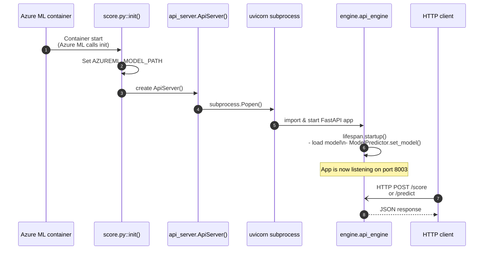
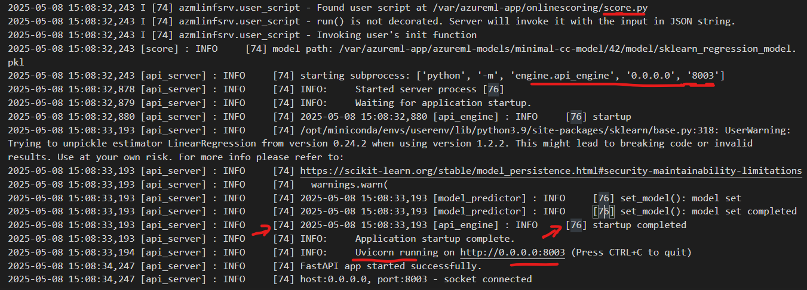
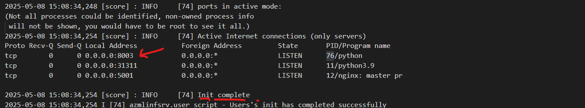
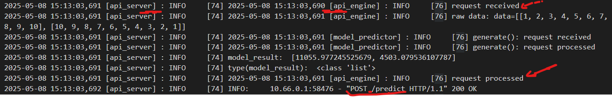

# About
This sample discusses in detail how to setup BYOC images and bring up the containers in non-default ports as per users' server side requirement, and publish/ consume the azureml realtime managed endpoint.

# Design architecture discussion in the api app
## Runtime flow



## Step-by-step

1. **Azure ML** launches the container and calls `score.py::init()`.
2. `init()`  
   • builds the full model path and stores it in `AZUREML_MODEL_PATH`.  
   • creates an `ApiServer` instance.
3. **ApiServer** starts **Uvicorn** in a child process; Uvicorn imports `engine/api_engine.py`.
4. In `api_engine` the FastAPI `lifespan` handler runs:  
   • reads `AZUREML_MODEL_PATH`  
   • loads the model (with `joblib`)  
   • caches it inside `ModelPredictor`.
5. The FastAPI app is now live (default port `8003`; readiness/liveness routed to `/`).
6. A **client** sends `POST /score` or `POST /predict`.  
   The corresponding route in `api_engine` calls `ModelPredictor` and returns a JSON payload.

The Azure ML scoring entry point (`run()` in `score.py`) stays unused because the real inference API is exposed through the FastAPI server.

## BYOC

```
environment:  
  name: fast-in-dockerfile
  image: {{ACR_NAME}}.azurecr.io/azureml-examples/single-model-fast1-in-dockerfile:1
  inference_config:
    liveness_route:
      path: /
      port: 8003
    readiness_route:
      path: /
      port: 8003
    scoring_route:
      path: /score
      port: 8003
```

- Key is to build the image app before hand
- Expose the expected port and api path in `inference_config`
- Make sure in that port, the api apps are available for routing

## Sample logs snippet



- We can see that score init() is actually started on PID 74.
- Because of subprocess.popen() call, the fastapi is spun on another process with PID 76.
- PID 76 is where, the 8003 port is actively listened, which is ready to serve the api requests.



- On api request from user, call is moved from `api_server` to `api_engine`.
- The `api_engine` is where input payload is processed, model prediction happened, and response is wrapped in expected format and returned to end user.

# How to run the sample?
## CLI
- Update variables in [deploy-custom-single-model.sh](./cli/deploy-custom-single-model.sh)
- Run the .sh file

```
cd cli
./deploy-custom-single-model.sh
```

## SDK
- Update the variables in [build_byoc_image.sh](./sdk/util-scripts/build_byoc_image.sh), which point to image details
- Follow notebook [online-endpoints-custom-container-singlmodel.ipynb](./sdk/online-endpoints-custom-container-singlmodel.ipynb)
- Use azureml_py310_sdkv2 conda environment


## Sources cross referenced
- [Referenced model](https://github.com/Azure/azureml-examples/tree/main/cli/endpoints/online/model-1)
- [CLI deploy of model as endpoint](https://github.com/Azure/azureml-examples/tree/main/cli/endpoints/online/custom-container/minimal/single-model)
- [SDL deploy model as endpoint](https://github.com/Azure/azureml-examples/tree/main/sdk/python/endpoints/online/custom-container)
- [Custom container to deploy as online endpoint](https://learn.microsoft.com/en-us/azure/machine-learning/how-to-deploy-custom-container?view=azureml-api-2&tabs=cli)
